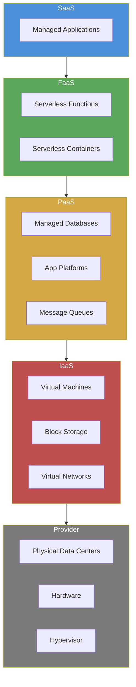
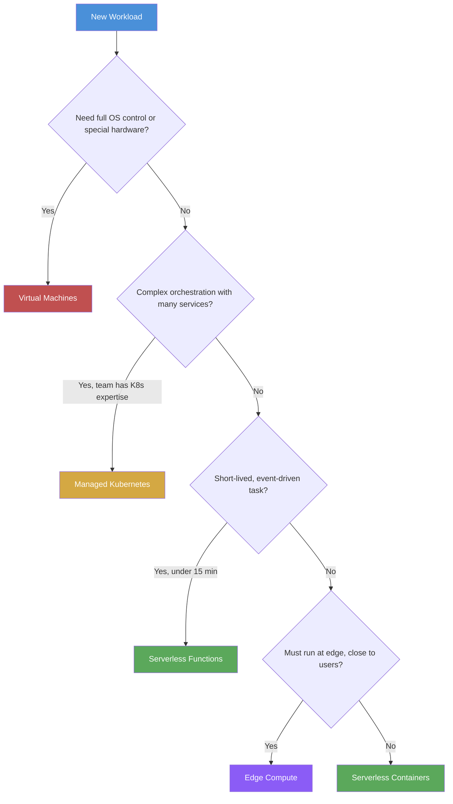
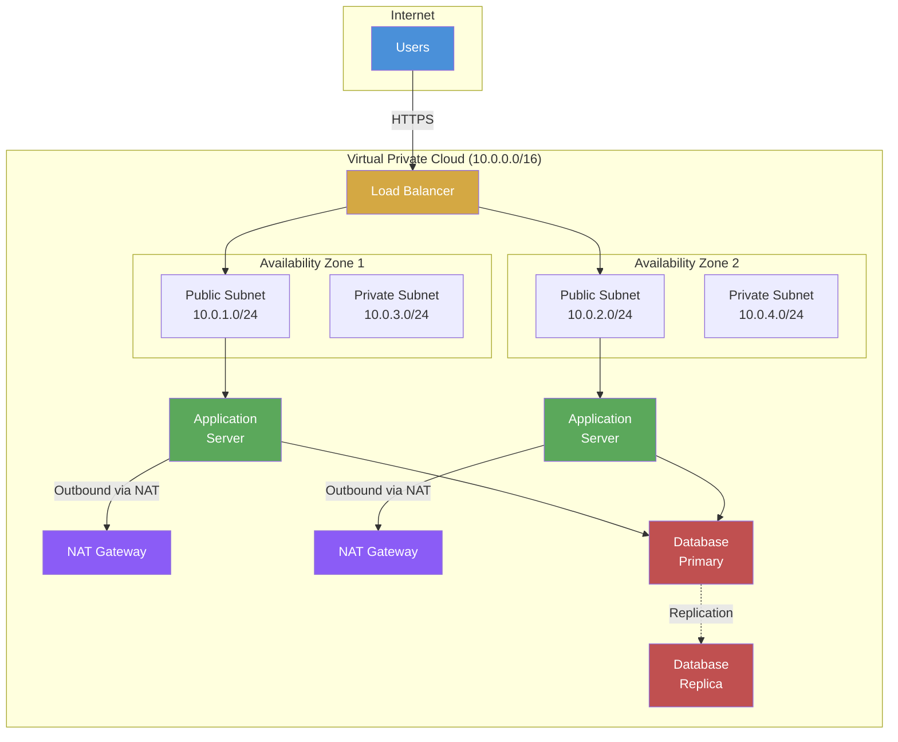

# Cloud Developer Fundamentals

A provider-agnostic guide to cloud computing concepts, architecture patterns, and operational practices for developers entering the cloud-native space in 2026.

---

## Table of Contents

1. [Why Cloud Computing in 2026](#1-why-cloud-computing-in-2026)
2. [The Cloud Mental Model](#2-the-cloud-mental-model)
3. [Compute Models](#3-compute-models)
4. [Storage & Databases](#4-storage--databases)
5. [Networking](#5-networking)
6. [Security & IAM](#6-security--iam)
7. [Infrastructure as Code](#7-infrastructure-as-code)
8. [Cost & Well-Architected](#8-cost--well-architected)
9. [What's Next](#9-whats-next)

---

## 1. Why Cloud Computing in 2026

Every company is now a cloud company. Whether you run a startup on a single cloud provider or operate a global platform spanning multiple providers, cloud computing is the default deployment target for software. On-premises infrastructure still exists, but it is increasingly reserved for specialized workloads: high-frequency trading floors with nanosecond latency requirements, classified government systems, or data sovereignty scenarios where regulations mandate physical control.

### The Evolution: IaaS to Serverless

Cloud computing evolved through distinct phases, each abstracting more operational burden away from developers:

| Phase | What You Manage | What the Provider Manages | Example |
|---|---|---|---|
| On-Premises | Everything: hardware, networking, power, cooling, OS, runtime, app | Nothing | Your own data center |
| IaaS | OS, runtime, your application | Hardware, virtualization, physical networking, power | EC2, Azure VMs, GCE |
| PaaS | Your application and its configuration | OS, runtime, middleware, scaling, patching | App Service, App Engine, Elastic Beanstalk |
| FaaS | Your function code and its triggers | Everything else including scaling to zero | Lambda, Azure Functions, Cloud Functions |
| Serverless Containers | Your container image and config | Orchestration, scaling, underlying infrastructure | Fargate, Cloud Run, Container Apps |

In 2026, serverless containers have matured to the point where they are the default compute choice for new workloads. You package your application as a container image, hand it to the cloud provider, and they handle orchestration, scaling, patching, and availability. You pay only when your code runs. Functions (FaaS) remain relevant for event-driven, short-lived tasks, but serverless containers now handle long-running processes, background jobs, and even streaming workloads that previously required dedicated VMs.

### The Multi-Cloud Reality

Most organizations do not choose a single cloud provider and stay there forever. The reality in 2026 is:

- **Startups** typically begin on one provider (often AWS or GCP) and expand as needs grow.
- **Enterprises** almost always run workloads across at least two providers, often driven by acquisitions, regulatory requirements, or best-of-breed service selection.
- **Edge workloads** may use provider-specific edge networks (Cloudflare, Fastly, AWS CloudFront) alongside primary cloud infrastructure.

This guide is deliberately provider-agnostic. We name specific services for reference, but the concepts, patterns, and decision frameworks apply regardless of which provider you use.

---

## 2. The Cloud Mental Model

### Regions, Availability Zones, and Edge Locations

Cloud providers operate a global network of data centers organized hierarchically:

- **Regions** are geographically distinct areas (e.g., US East, Europe West, Asia Pacific). Each region is isolated from others. Deploying in a region means your data stays in that geography unless you explicitly move it.
- **Availability Zones (AZs)** are physically separated data centers within a region. Each AZ has independent power, cooling, and networking. Most production architectures distribute workloads across at least two AZs for high availability.
- **Edge Locations** are points of presence (PoPs) distributed globally for content delivery (CDN), DNS resolution, and edge compute. They cache content close to users, reducing latency.

When you design a cloud architecture, your first decisions are: which region(s) to deploy in, how many AZs to span, and whether edge locations serve your users directly.

### The Shared Responsibility Model

Cloud security follows a shared responsibility model. The provider secures the infrastructure; you secure what you build on top of it.

| Layer | Provider Responsibility | Your Responsibility |
|---|---|---|
| Physical security (data centers) | Secured | Not applicable |
| Hardware and virtualization | Patched and maintained | Not applicable |
| Network infrastructure | DDoS protection, fiber, routers | Security groups, NACLs, VPN config |
| Operating system (IaaS) | Hypervisor only | OS patches, hardening |
| Platform (PaaS) | Runtime, middleware, OS | Application code, configuration |
| Application (SaaS/FaaS) | Everything platform-level | Data, access policies, secrets |
| Data | Physical media encryption | Classification, access controls, encryption keys |
| Identity | IAM service availability | User management, least privilege, MFA |

The boundary shifts depending on the service model. With a VM (IaaS), you patch the operating system. With a managed function (FaaS), you never think about the OS. But in every case, **you own your data, your access policies, and your application logic**.

### Cloud Architecture Layers

You manage everything at your layer and above. The provider manages everything below. Moving up the stack reduces operational burden but reduces control over the underlying infrastructure.

---

## 3. Compute Models

Choosing the right compute model is the first architectural decision you make for any workload. Each model trades off control for operational simplicity.

### Compute Model Comparison

| Model | Cold Start | Max Duration | Scaling | Cost Model | Best For |
|---|---|---|---|---|---|
| Virtual Machines | Minutes (boot) | Unlimited | Manual or auto-scaling groups | Per-second/hour | Legacy apps, full OS control, GPU workloads |
| Kubernetes / Managed Containers | Seconds | Unlimited | Horizontal pod autoscaling | Per-node or per-pod | Microservices, complex orchestration needs |
| Serverless Containers | Seconds | Hours to unlimited | Automatic, scale to zero | Per-request + compute time | Web APIs, background jobs, most new workloads |
| Functions (FaaS) | ms to seconds | Minutes (5-15 min) | Instant, massive scale | Per-invocation + duration | Event processing, webhooks, data transformations |
| Edge Compute | Sub-second | Seconds to minutes | Automatic at edge PoPs | Per-request | CDN logic, auth at edge, real-time personalization |

### When Each Fits

- **Virtual Machines** when you need full OS-level control: custom kernels, specialized hardware (GPUs, FPGAs), or software that requires a persistent OS environment. Also the right choice for lifting-and-shifting legacy applications before refactoring.

- **Kubernetes / Managed Containers** when you have complex orchestration requirements: many microservices that need service mesh, advanced networking policies, or when your team already has Kubernetes expertise. Managed Kubernetes (EKS, AKS, GKE) removes the control plane management burden.

- **Serverless Containers** for most new workloads in 2026. You get container portability without cluster management. Services like Cloud Run, Fargate, and Container Apps handle scaling, availability, and patching. Pay only when requests are being served.

- **Functions (FaaS)** for short-lived, event-driven work: processing file uploads, handling webhook payloads, running scheduled cleanup jobs, transforming data between services. Keep functions small, stateless, and fast.

- **Edge Compute** for logic that must run close to users: authentication checks, A/B testing, content personalization, bot mitigation. Edge functions execute at CDN PoPs with single-digit millisecond latency.

### Compute Decision Flowchart

---

## 4. Storage & Databases

Storage is not one thing. The access pattern of your data determines the right storage choice. Optimizing for the wrong pattern leads to poor performance, high costs, or both.

### Storage Types

| Storage Type | AWS | Azure | GCP | Access Pattern | Latency | Use Case |
|---|---|---|---|---|---|---|
| Object Storage | S3 | Blob Storage | Cloud Storage | Key-based read/write | 10-100ms | Files, backups, static assets, data lakes |
| Block Storage | EBS | Managed Disks | Persistent Disk | Block-level I/O | Sub-ms | VM boot disks, databases on VMs |
| File Storage | EFS | Azure Files | Filestore | NFS/SMB file share | Low ms | Shared file systems, CMS, dev tools |
| Archive Storage | S3 Glacier | Archive Storage | Archive | Rare retrieval | Hours | Compliance archives, long-term backups |

### Database Types

| Category | AWS | Azure | GCP | Pattern | When to Use |
|---|---|---|---|---|---|
| Relational (Managed) | RDS / Aurora | SQL Database / Database for PostgreSQL | Cloud SQL / AlloyDB | Structured data, ACID transactions, complex queries | User accounts, orders, financial records, any data with relationships |
| NoSQL (Key-Value) | DynamoDB | Cosmos DB (Table API) | Firestore / Bigtable | High-throughput, low-latency key lookups | Session data, shopping carts, user profiles, IoT telemetry |
| NoSQL (Document) | DynamoDB | Cosmos DB (MongoDB API) | Firestore | Flexible schema, nested documents | Content management, catalogs, configuration data |
| In-Memory Cache | ElastiCache | Azure Cache for Redis | Memorystore | Sub-ms reads for hot data | API response caching, session storage, leaderboards |
| Data Warehouse | Redshift | Synapse Analytics | BigQuery | Analytical queries over large datasets | Business intelligence, reporting, historical analysis |
| Vector Database | OpenSearch | AI Search | Vertex AI Vector Search | Similarity search on embeddings | RAG pipelines, recommendation engines, semantic search |

### How to Choose

1. **Start with the access pattern.** Does your application need ACID transactions with relational integrity? Start with a managed relational database. Does it need single-digit millisecond reads at massive scale with simple key lookups? A NoSQL key-value store fits better.

2. **Use caching aggressively.** If the same query runs dozens of times per second, put a Redis (or equivalent) cache in front of your database. Cache invalidation is a hard problem, but the performance gains are worth it for hot data.

3. **Separate transactional and analytical workloads.** Your transactional database (OLTP) handles inserts, updates, and real-time queries. Your data warehouse (OLAP) handles analytical queries across historical data. Do not run heavy analytics on your transactional database; replicate the data to a warehouse instead.

4. **Object storage for everything large and infrequent.** Files, images, backups, logs, and data lake assets belong in object storage. It is cheap, durable (11 nines), and scales without limit.

---

## 5. Networking

Networking is the backbone of every cloud architecture. Every service communicates over networks you configure, secure, and monitor. Understanding virtual networking is non-negotiable.

### Core Networking Concepts

**Virtual Private Cloud (VPC)** is your isolated network within the cloud provider's infrastructure. You define the IP address range, create subnets, and control traffic flow. Nothing in your VPC is accessible from the internet unless you explicitly allow it.

**Subnets** are subdivisions of your VPC CIDR block, each placed in a specific availability zone. Public subnets have a route to an internet gateway. Private subnets do not, and rely on NAT gateways for outbound internet access.

**Security Groups** are stateful firewalls attached to individual resources (VMs, databases, load balancers). They control inbound and outbound traffic at the port and protocol level. They are your first line of defense.

**Network ACLs (NACLs)** are stateless, subnet-level firewalls that provide an additional layer of traffic control. They are less commonly modified than security groups but useful for broad deny rules.

**Load Balancers** distribute incoming traffic across multiple targets. They handle health checking, SSL termination, and traffic routing. Every production service sits behind a load balancer.

**DNS** (Route 53, Cloud DNS, Azure DNS) resolves domain names to load balancer IPs. Managed DNS services provide low-latency resolution, health-check-based routing, and integration with CDN.

**CDN** (CloudFront, Azure CDN, Cloud CDN) caches content at edge locations worldwide. Static assets, API responses, and even dynamic content benefit from edge caching.

### VPC Architecture Diagram

### Key Principles

- **Put application servers in private subnets.** They should never have public IP addresses. All inbound traffic arrives through the load balancer; all outbound internet access routes through NAT gateways.
- **Span at least two availability zones.** If one data center fails, the other continues serving traffic. Load balancers and databases replicate across AZs automatically.
- **Use security groups, not just NACLs.** Security groups are stateful and attached to resources, making them easier to reason about. Use NACLs as a secondary defense layer for broad deny rules.
- **Design your CIDR ranges carefully.** Plan for growth. A `/16` VPC gives you 65,536 addresses. Subnets with `/24` give 256 addresses each. Do not paint yourself into a corner with tight ranges.

---

## 6. Security & IAM

Security in the cloud is not a feature you add later. It is a set of practices you build into every architectural decision from day one.

### Identity and Access Management (IAM)

IAM is the foundation of cloud security. Every person, service, and application that interacts with your cloud resources does so through an identity. IAM defines who can do what to which resources.

Core principles:

- **Least privilege:** Grant only the permissions required for the task. An application that reads from one S3 bucket does not need full S3 access, and certainly not administrative access to the entire account.
- **Role-Based Access Control (RBAC):** Group permissions into roles, assign roles to identities. Developers get a developer role with access to dev resources. Operators get an operator role with broader access. Auditors get read-only access to logs and configurations.
- **Service identities:** Applications and services authenticate using service accounts or assigned roles, not shared credentials. A serverless function running your API has its own identity with scoped permissions.
- **Multi-Factor Authentication (MFA):** Required for all human identities with console or CLI access. Non-negotiable for any account with write permissions.
- **Temporary credentials:** Prefer short-lived tokens (STS, managed identities, workload identity) over long-lived access keys. Temporary credentials expire automatically, limiting the blast radius of a leak.

### Encryption

| Type | Purpose | When | Who Manages Keys |
|---|---|---|---|
| Encryption at rest | Protect stored data | Always, by default | Provider-managed by default; customer-managed for regulated workloads |
| Encryption in transit | Protect data in motion | Always (TLS 1.2+) | Certificate management (ACM, Let's Encrypt) |
| Application-level encryption | Protect sensitive fields before storage | PII, financial data, health records | Your application |
| Envelope encryption | Encrypt the encryption key | Provider-managed services use this by default | KMS (Key Management Service) |

In 2026, encryption at rest and in transit are enabled by default on virtually every cloud service. Your responsibility is ensuring application-level encryption for sensitive fields and managing key rotation for customer-managed keys.

### Secrets Management

Never store secrets in code, environment variables in CI logs, or unencrypted configuration files. Use a dedicated secrets manager:

| Provider | Service | Features |
|---|---|---|
| AWS | Secrets Manager | Automatic rotation, cross-account access, audit logging |
| Azure | Key Vault | Secrets, keys, certificates, HSM-backed |
| GCP | Secret Manager | Versioning, replication policies, audit logs |
| Multi-cloud | HashiCorp Vault | Platform-agnostic, dynamic secrets, PKI |

Inject secrets at runtime. Your application reads the secret from the manager when it starts, never from a file checked into version control.

### Compliance Frameworks

Depending on your industry, your cloud architecture must comply with specific frameworks:

- **SOC 2 Type II:** Service organization controls for security, availability, processing integrity, confidentiality, and privacy. Required for most B2B SaaS.
- **HIPAA:** Health data protection in the US. Requires encryption, access controls, audit logging, and Business Associate Agreements with cloud providers.
- **GDPR:** European data protection. Requires data residency controls, right to erasure, and data processing agreements.
- **PCI DSS:** Payment card data security. Network segmentation, encryption, access logging, and regular vulnerability scanning.
- **ISO 27001:** Information security management system certification. Broad framework applicable to any organization.

Cloud providers maintain certifications for their services, but compliance is a shared responsibility. The provider's SOC 2 report covers their infrastructure; your SOC 2 report must cover how you configured and use that infrastructure.

---

## 7. Infrastructure as Code

Infrastructure as Code (IaC) means defining your entire cloud infrastructure in version-controlled configuration files rather than clicking through web consoles or running one-off CLI commands. Every load balancer, database, network rule, and IAM policy is declared in code. Changes go through code review. Rollbacks are git reverts.

### IaC Tools

| Tool | Type | Language | Multi-Cloud | State Management | Best For |
|---|---|---|---|---|---|
| Terraform | Declarative | HCL | Yes | Remote state backend (S3, GCS, Azure Blob) | Default choice for most teams |
| Pulumi | Declarative | TypeScript, Python, Go, C# | Yes | Pulumi Cloud or self-managed backend | Teams that want general-purpose languages |
| CloudFormation | Declarative | YAML/JSON | AWS only | AWS-managed | AWS-only shops |
| Bicep | Declarative | Bicep DSL | Azure only | Azure-managed | Azure-only shops |
| CDK (Terraform / CloudFormation) | Imperative | TypeScript, Python, etc. | Yes (TF CDK) / AWS only (AWS CDK) | Inherits underlying tool | Developers who prefer imperative code |

### Why Terraform Dominates

Terraform is the de facto standard for IaC in 2026 for three reasons:

1. **Provider ecosystem:** HashiCorp and the community maintain providers for every major cloud provider, dozens of SaaS platforms, and internal tools. You manage AWS, Azure, GCP, Cloudflare, GitHub, Datadog, and your own APIs from a single tool.

2. **State management:** Terraform tracks the real-world state of your infrastructure in a state file. Before applying changes, it compares desired state (your code) against actual state (the state file) and generates a plan showing exactly what will change. This plan-and-apply workflow prevents accidental destruction.

3. **Modular design:** Terraform modules let you encapsulate reusable infrastructure patterns. A "web service" module might include a load balancer, auto-scaling group, security groups, and DNS record. Teams share modules across projects, ensuring consistency.

### Key Practices

- **Remote state:** Never store state files locally. Use a remote backend (S3 + DynamoDB for locking, or Terraform Cloud) so the team shares state and concurrent changes are prevented by locking.
- **State locking:** Always enable state locking to prevent two engineers from applying changes simultaneously, which corrupts state.
- **Drift detection:** Regularly run `terraform plan` to detect configuration drift. If someone made a manual change through the console, Terraform plan will flag it. Drift is a signal that either a process is broken or an emergency change bypassed IaC.
- **Least privilege for CI:** Your CI pipeline's Terraform identity should have only the permissions needed to manage the resources in its scope, not full account access.
- **Module structure:** Organize modules by lifecycle. Networking infrastructure (VPCs, subnets) changes rarely. Application infrastructure (services, databases) changes frequently. Separate them so changes to one do not require re-planning the other.

---

## 8. Cost & Well-Architected

Cloud cost management is not a financial exercise delegated to the finance team. It is an engineering discipline. The architectural decisions you make directly determine the cost profile of your system.

### Cost Optimization Strategies

| Strategy | Description | Impact |
|---|---|---|
| Right-sizing | Match instance/container sizes to actual utilization. A service using 10% CPU on a 4-vCPU instance should be on a 1-vCPU instance. | 30-60% savings on compute |
| Reserved capacity | Commit to 1-3 year usage for steady-state workloads in exchange for significant discounts (40-70%). | Largest single savings lever |
| Auto-scaling | Scale resources to match demand. Pay for capacity only when needed. Scale to zero for dev/staging. | Eliminates over-provisioning |
| Serverless where possible | Per-request pricing means zero cost for idle time. Serverless containers and functions only bill when serving traffic. | Pay only for what you use |
| Storage tiering | Move infrequently accessed data to cheaper storage tiers automatically. S3 Intelligent-Tiering, Azure Cool/Archive. | 50-80% on storage costs |
| Spot/Preemptible instances | Use surplus cloud capacity at 60-90% discounts for fault-tolerant workloads (batch jobs, CI, data processing). | Massive savings for right workloads |
| Delete unused resources | Find and delete unattached disks, idle load balancers, forgotten snapshots, and orphaned resources. | Immediate savings with no risk |

### FinOps

FinOps (Cloud Financial Operations) is the practice of bringing financial accountability to cloud spending. In 2026, FinOps is mainstream. Key principles:

- **Teams own their costs.** Each engineering team sees and is accountable for their cloud spend. Shared dashboards show cost by team, service, and environment.
- **Cost is a metric in architecture reviews.** Every design decision includes a cost estimate. Decisions are measured against actual spend post-deployment.
- **Tagging is mandatory.** Every resource must carry tags identifying the team, project, environment, and cost center. Untagged resources are flagged and eventually terminated.
- **Budgets and alerts.** Set spending budgets per team/project. Automated alerts trigger when spending approaches or exceeds the budget.

### Well-Architected Framework

Every major cloud provider publishes a Well-Architected Framework. While the specifics differ, the core pillars are consistent:

| Pillar | Description | Key Question |
|---|---|---|
| **Reliability** | System recovers from failures, scales to meet demand, and mitigates disruptions | Can your system survive the loss of an availability zone? |
| **Security** | Protect data, systems, and assets through risk assessments and mitigation strategies | Can every access decision be traced to an approved identity? |
| **Performance Efficiency** | Use resources efficiently, maintain efficiency as demand changes and technologies evolve | Are you using the right resource type for your workload? |
| **Cost Optimization** | Avoid unnecessary costs, achieve business outcomes at the lowest price point | Do you know the unit economics of your application per customer or per transaction? |
| **Operational Excellence** | Run and monitor systems, continuously improve processes and procedures | Can you deploy a change and detect a failure within minutes? |
| **Sustainability** | Minimize the environmental impact of running cloud workloads | Are you maximizing utilization to reduce wasted energy? |

The sustainability pillar, formalized across all major providers by 2024-2025, reflects the growing importance of environmental impact. Efficient resource utilization is not just cost-effective; it reduces the carbon footprint of your workloads. Serverless and managed services are inherently more sustainable because providers pack workloads densely on shared hardware.

### Conducting a Well-Architected Review

Schedule a Well-Architected review for every production workload at least annually. Walk through each pillar, answer the review questions, and create action items for gaps. Common findings in reviews include:

- No multi-AZ deployment for databases
- Missing encryption for data at rest or in transit
- Over-provisioned compute resources (right-size them)
- No disaster recovery plan or untested backup restoration
- IAM policies that are too broad (tighten them)
- No cost allocation tags (add them)

---

## 9. What's Next

This guide covers the fundamentals. The cloud ecosystem continues to evolve rapidly. Areas to explore next:

- **Serverless containers in depth:** Deploying, scaling, and operating containerized workloads without managing nodes. This is the dominant compute paradigm for new workloads.
- **Event-driven architecture:** Using message queues, event buses, and streaming platforms to decouple services and build reactive systems.
- **Observability:** Logging, metrics, tracing, and alerting. You cannot operate what you cannot see. OpenTelemetry is the emerging standard.
- **GitOps:** Managing infrastructure and application deployments through git pull requests. ArgoCD, Flux, and similar tools automate the sync between git and live state.
- **AI services:** Every cloud provider offers managed AI/ML services for vision, language, translation, and generative AI. Understanding when to use managed AI services versus custom models is a key skill in 2026.
- **Multi-cloud networking:** Interconnecting VPCs across providers with private links, transit gateways, and service meshes.
- **Platform engineering:** Building internal developer platforms that abstract cloud complexity. Backstage, Crossplane, and internal tooling platforms are gaining traction.

The concepts in this guide apply across all cloud providers. Learn the patterns, understand the tradeoffs, and apply them regardless of which provider you work with.

---

*Cloud Developer Learning Path -- TP-Coder Innovation Hub*
